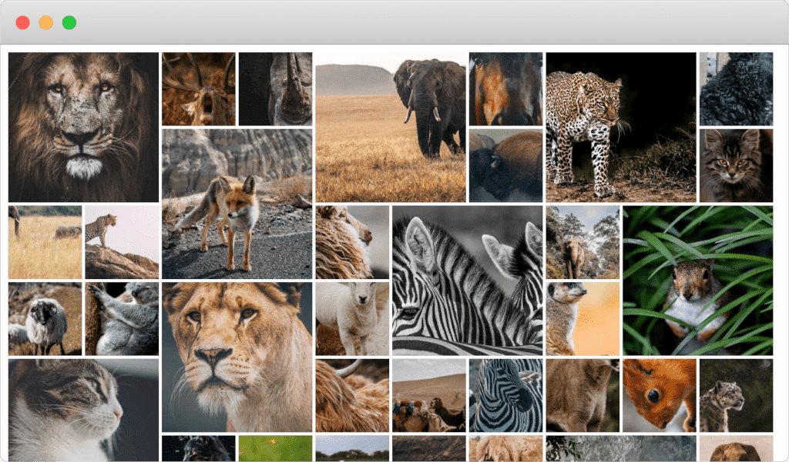

Pixel
=====



Pixel is a small script intended to create photo albums to upload on your server.

## How-to

First create a virtual environment and install the necessary dependency:
```
python3 -m venv venv
. venv/bin/activate
pip install -r requirements.txt
```

Then, just point the script towards the directory where you store the photos you want to make an album of:
```
./pixel /path/to/photo/album
```

Pixel will create an `index.html` file and a `pixel` directory inside the targeted directory. These contain the files that make up the album. The source photos are not needed anymore.  
Example album created from [an unsplash collection](https://unsplash.com/collections/181581/animals): [https://niels.fr/demo/pixel](https://niels.fr/demo/pixel)

## Remarks

- Pixel will only use the photos in the first level of the target directory. It doesn't look into subdirectories.
- The photos will be ordered by their datetime if given in the exif metadata (otherwise, the file last modified date is used).
- It will not recompute photos that are already in the pixel directory (based on filename).
- Big miniatures are chosen randomly
